# 🍔 FastSnack

Aplicación de escritorio para la gestión de pedidos de una snackería rápida. Permite registrar clientes, gestionar productos del menú, realizar pedidos y generar recibos/facturas.

---

## 👥 Integrantes del grupo

| Nombre |
|--------|
| Ashley Navarro|
|Adubel Aguiar   | 
|Romina espinoza  |
|Emily Medrano  | 
|Alisson pinoargotty |
|Aumala Domenika | 


---

## 📋 Descripción del proyecto

**FastSnack** es una aplicación de escritorio desarrollada en Java (NetBeans) que permite:

- 🔐 **Login y Registro** de clientes con validación de correo y contraseña
- 🛒 **Menú de productos** (Hamburguesas, Papitas Fritas, Nuggets, Hot Dogs)
- 📦 **Registro de pedidos** con cálculo automático de subtotal, IVA (15%) y total
- 🧾 **Generación de recibo/factura** con opción de imprimir
- 💾 **Persistencia** de clientes y pedidos en base de datos MySQL

---

## 📸 Evidencias de funcionamiento

| Pantalla | Descripción |
|----------|-------------|
| 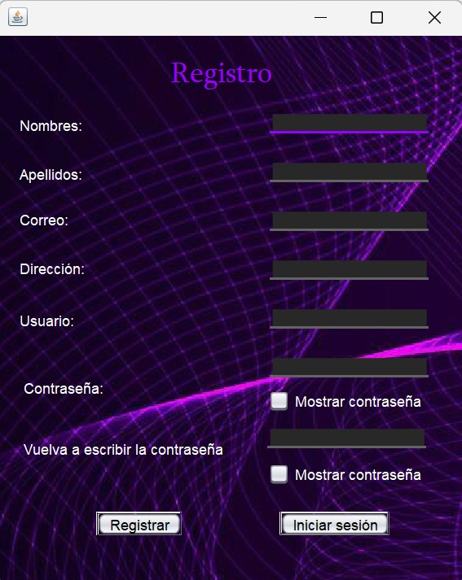 |Formulario de registro de cliente |
| 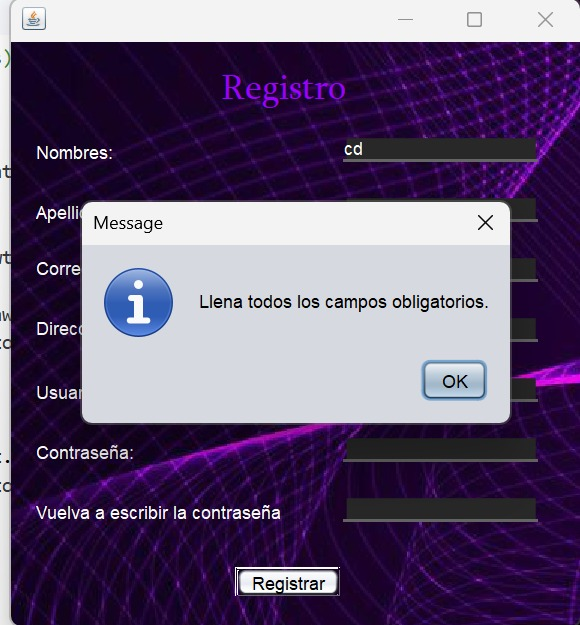 | Validación: campos obligatorios |
| 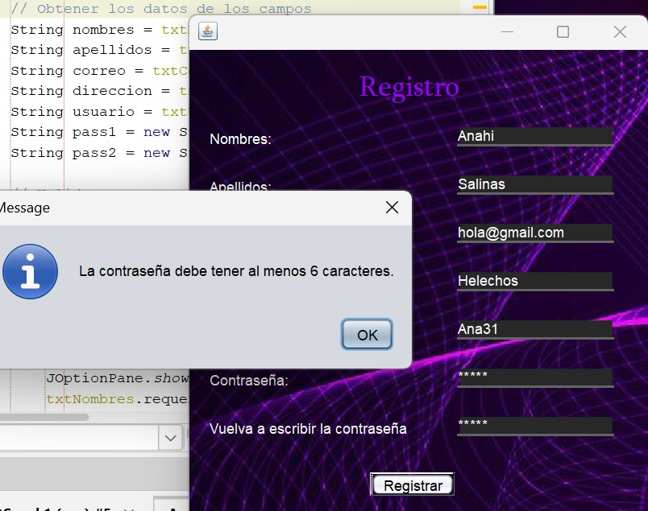 | Validación: contraseña mínima 6 caracteres |
| 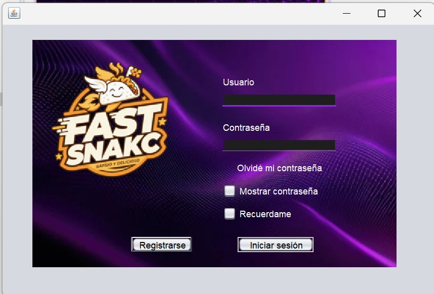 | Pantalla de inicio de sesión |
| 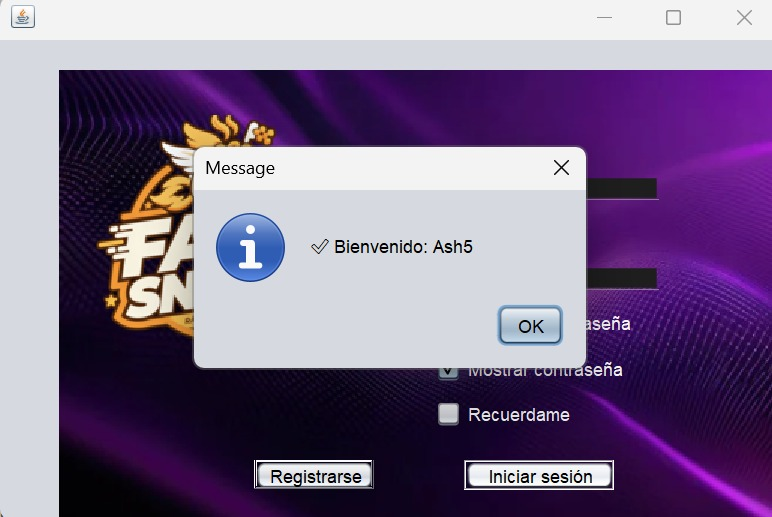 | Mensaje de bienvenida tras iniciar sesión |
| 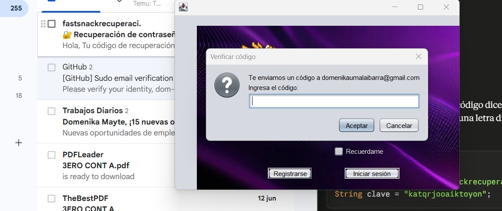 | Código de recuperación |
| 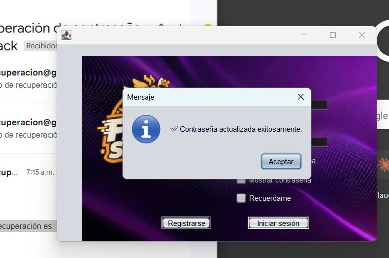 | Validación exitosa |
| 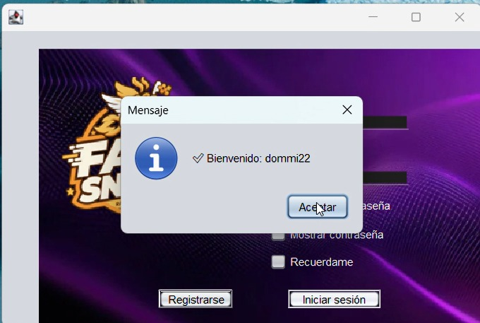 | Mensaje de bienvenida tras iniciar sesión |
| 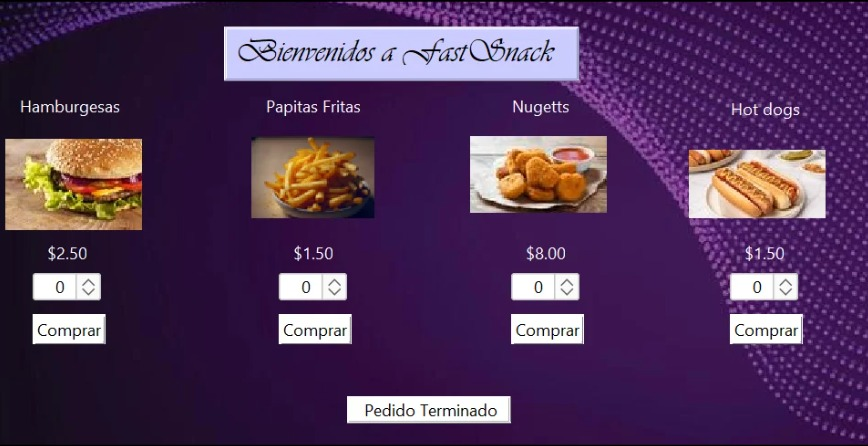 | Menú de productos con precios |
| 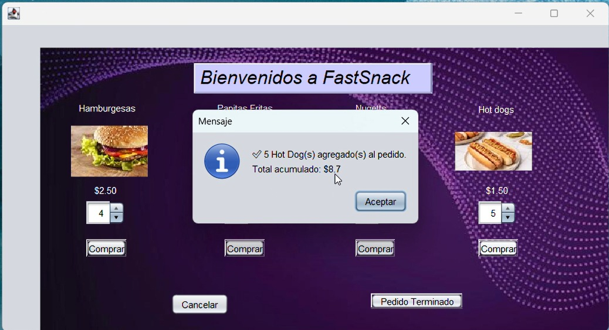 | Demostración del precio que se va acumulando |
| 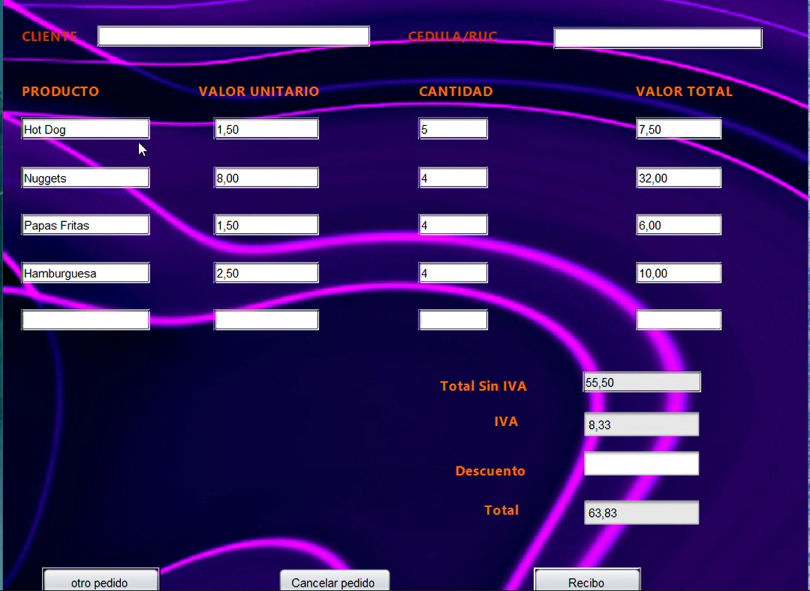 | Automatización del pedido |
| 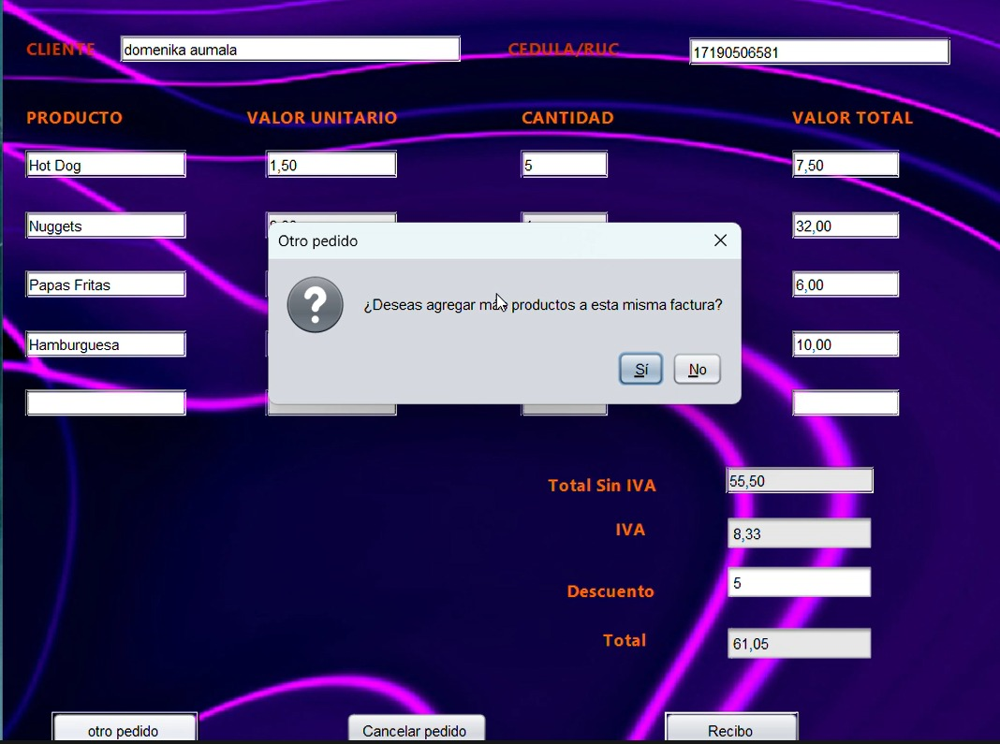 | Mensaje de sí desea hacer otro pedido con la misma factura |
| 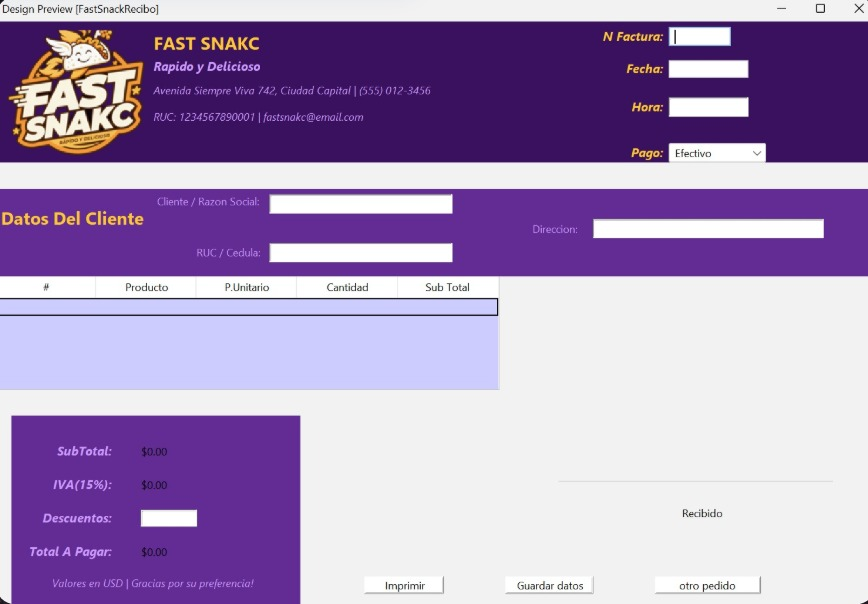 | Recibo de pago con subtotal, IVA y total |

---

## 🛠️ Tecnologías utilizadas

| Tecnología | Versión |
|-----------|---------|
| Java (JDK) | 8 o superior |
| NetBeans IDE | 12+ |
| MySQL | 5.7 o superior |
| JDBC (MySQL Connector/J) | 8.x |
| Patrón de diseño | DAO + Singleton |

---

## ⚙️ Instrucciones de instalación y ejecución

### 1. Requisitos previos

- Tener instalado **JDK 8** o superior
- Tener instalado **NetBeans IDE**
- Tener instalado **MySQL Server**
- Tener el conector **mysql-connector-java** en el classpath del proyecto

### 2. Configurar la base de datos

1. Abre **MySQL Workbench** o tu cliente MySQL favorito
2. Ejecuta el script de creación:
   ```sql
   SOURCE database/fastsnack_schema.sql;
   ```
3. Ejecuta el script de datos de prueba (opcional):
   ```sql
   SOURCE database/fastsnack_data.sql;
   ```

### 3. Configurar la conexión

Abre el archivo `src/Config/Conexion.java` y edita las credenciales si es necesario:

```java
private final String url      = "jdbc:mysql://localhost:3306/FastSnackBD?useSSL=false&serverTimezone=UTC";
private final String user     = "root";
private final String password = ""; // Cambia por tu contraseña de MySQL
```

### 4. Abrir y ejecutar en NetBeans

1. Clona o descarga este repositorio
2. En NetBeans: **File → Open Project** → selecciona la carpeta `AppFastSnack`
3. Agrega el conector MySQL: clic derecho en **Libraries → Add JAR/Folder**
4. Presiona **F6** o el botón **Run Project**

---

## 📁 Estructura del proyecto

```
FastSnack/
├── AppFastSnack/
│   └── src/
│       ├── Config/          # Conexión a la base de datos (Singleton)
│       ├── DAO/             # Acceso a datos (ClienteDAO, PedidoDAO, UsuarioDAO)
│       ├── Modelo/          # Clases del dominio (Cliente, Pedido, Producto...)
│       ├── Presentacion/    # Interfaces gráficas (Login, Registro, Factura, Recibo...)
│       ├── Imagenes/        # Recursos gráficos
│       └── utilidades/      # Excepciones personalizadas
├── database/
│   ├── fastsnack_schema.sql # Script de creación de tablas
│   └── fastsnack_data.sql   # Script de datos de prueba
├── screenshots/             # Evidencias de funcionamiento
├── .gitignore
└── README.md
```
---

## 📄 Licencia

Proyecto académico 
